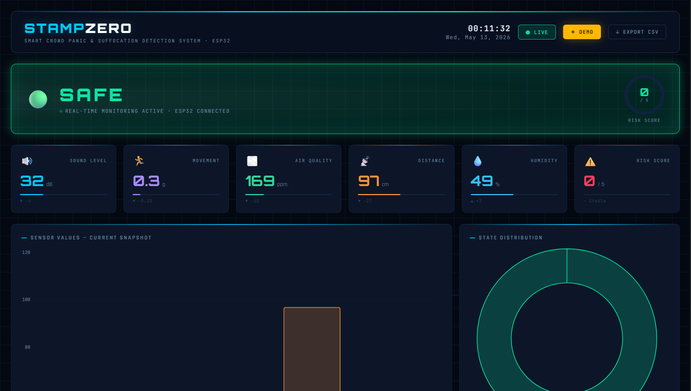

# STAMPZERO 🚨

Smart Crowd Panic & Suffocation Detection System using ESP32 and IoT Dashboard.

---

## 📌 Overview

STAMPZERO is a real-time IoT-based crowd monitoring and suffocation risk detection system designed to identify panic situations, overcrowding, and unsafe crowd conditions using multiple sensors and a live dashboard.

The system continuously analyzes environmental and movement-related parameters and classifies the situation into:

- 🟢 SAFE
- 🟡 WARNING
- 🔴 CRITICAL

Sensor data is transmitted from ESP32 over WiFi and visualized on a futuristic animated dashboard.

---

## ⚡ Features

- Real-time sensor monitoring
- Multi-sensor crowd risk analysis
- SAFE / WARNING / CRITICAL detection
- Live ESP32 web API
- Futuristic animated dashboard
- Alert history logging
- Real-time charts and analytics
- Demo Mode + Live Mode
- WiFi-based communication
- GitHub-hosted dashboard

---

## 🛠️ Hardware Used

- ESP32
- MPU6050 Accelerometer & Gyroscope
- MQ135 Air Quality Sensor
- Sound Sensor (LM393 / LM358)
- Ultrasonic Sensor (HC-SR04)
- Humidity Sensor
- LEDs
- Buzzer
- Breadboard & Jumper Wires

---

## 💻 Software & Technologies

- HTML
- CSS
- JavaScript
- Chart.js
- ESP32 Web Server
- Arduino IDE
- GitHub Pages

---

## 📷 Project Preview

### 🔧 Hardware Setup


### 🌐 Dashboard Interface


### 🚀 Live Working


---

## 🧠 Working Principle

The system collects real-time data from multiple sensors connected to the ESP32.

The ESP32:
1. Reads all sensor values
2. Calculates a risk score
3. Determines the crowd condition
4. Hosts a local web server
5. Sends sensor data as JSON through WiFi

The dashboard fetches this data and visualizes it using:
- Live status indicators
- Animated sensor cards
- Real-time charts
- Alert history logs

---

## 📊 Sensor Logic

The system uses combined sensor analysis instead of relying on a single sensor.

Factors considered:
- Excessive sound levels
- Sudden movement spikes
- Poor air quality
- Reduced distance / overcrowding
- High humidity

Higher combined abnormal readings increase the risk score.

---

## 🌐 Dashboard

The dashboard supports:
- Real-time live mode
- Demo simulation mode
- Animated UI effects
- Responsive design
- Smooth data visualization

Hosted using GitHub Pages.

---

## 🔄 System Flow

```text
Sensors → ESP32 → WiFi → Web API → Dashboard Visualization
```

---

## 🚨 Alert States

| State | Description |
|---|---|
| 🟢 SAFE | Normal crowd conditions |
| 🟡 WARNING | Elevated crowd activity detected |
| 🔴 CRITICAL | Panic / suffocation risk detected |

---

## 🎯 Future Improvements

- Cloud database integration
- Mobile app support
- GPS-based crowd mapping
- AI-based prediction system
- Emergency alert integration
- Remote monitoring from anywhere

---

## 👨‍💻 Author

Lakshay Yadav

Mechatronics & Automation Engineering  
VIT University

---

## ⭐ Project Goal

STAMPZERO aims to improve crowd safety by providing an affordable and real-time crowd panic detection system using IoT technology.
